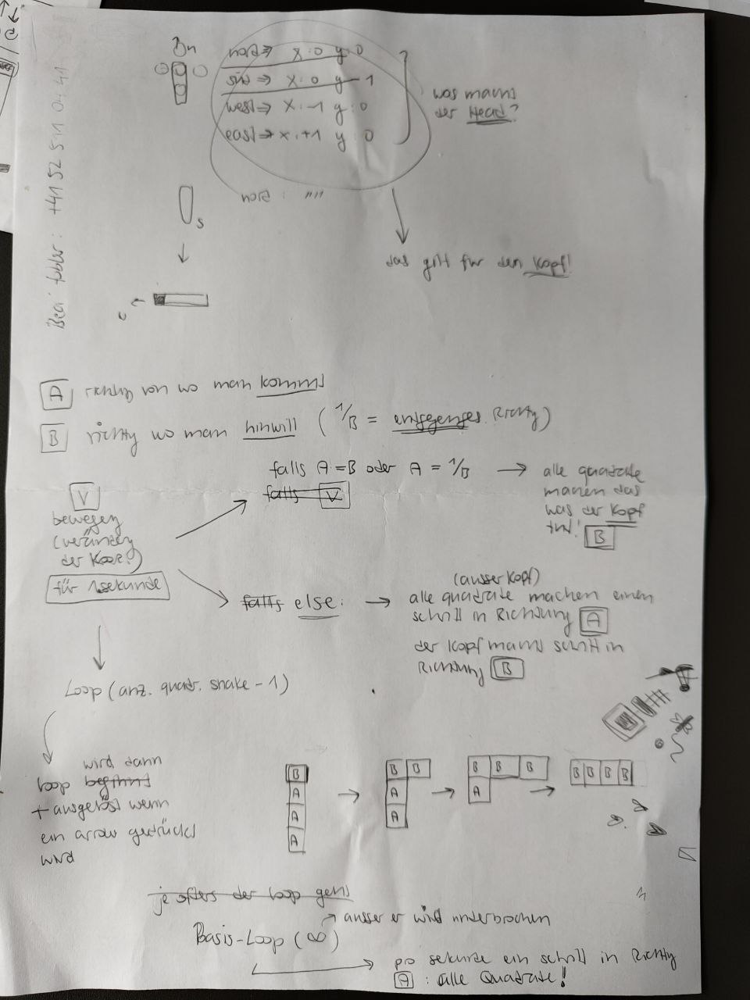

## mportant things to know for elm

### run the app
elm reactor

### elm-commands
- comments = `{-| this is a comment -}`
- type deklarieren

## my plan for the app + pseudo-code

screenshot:


### objekte/typen:
- schlange -> eine liste vn dictionaries, jedes dictionary ist besteht aus einer x und y koordinate, jedes dictionary repräsentiert ein quadrat der schlangenkörpers
- kompass -> norden, süden, weten, osten und die koordinatenbewegungen um in diese richtung zu gehen!

Pseudo-Code:
```elm

{-| this compass tells the head where to go, only the head because the rest of the body follows the previous direction -}
type compass {
    compass = {
        'north': {x:0, y:+1},
        'south': {x:0, y:-1},
        'west': {x:-1, y:0},
        'east': {x:+1, y:0}
    }
}

type html-messages {
    arrow-up:
    arrow-down:
    arrow-left:
    arrow-right:
}

```

### globale variablen
dynamische variablen:
- direction (in diese richting bewegt sich die schlange gerade oder solte sich bewegen)

statische variablen:
- urzeigersinn-liste
- gegenuhrzeigersinn-liste


Pseudo-Code:
```elm

{-| direction: woher man kommt (A) un wohin man hin will (B) -}
direction_A = 'north';
direction_B;

food_coordinates = {x:.., y:..}
snake_koordinates = [{x:.., y:..}, ...]


```

### funktionen:
- main-function -> die schlange die sich ständig um ein feld bewegt pro sekunde, und auf folgende html-messages wartet ud diese entgegen nimmt und die dazu benötigten helferfunktionen ausführt 
    - pfeile gedrückt wurden
    - das fressen gefunden wurde
    - die schlagne den rand verlässt

- spielfeld zeichnen mit folgenen sachen -> speilfeld aus 20X20 spielfeldern (ich will es so machen dass man den palt zwischen den quadraten sehen kann)
    - schlange
    - futternapf
    - das spielfeld mit 20X20 feldern

- function which generates a randon set of koordinates for the food


```elm

{-| main function -}
def main() {

    canvas_erstellen()

    {-| dieser loop rendered die schlange 1mal/pro sekunde, es kann auch nur 1mal pro sekunde eine html-message wahrgenommen werden -}
    Loop der jede sekunde eintrifft {
        if html_message {
            direction_B = arrow_to_direction(html_message)
        }
        else {
            direction_B = direction_A 
        }

        snake_move() {-| die schlange bewegt sich in richting direction_B, bewegen heisst das sich die koordinaten der schlange verändern -}

        koordinaten_einfärben(futter_kordinaten)
        koordinaten_einfärben(snake_koordinaten)

        if snake[0] == futter_koordinaten {
            extrude_snake()
        }
    }
}

def canvas_ertellen() {
    ...
}

{-| diese funktion verändert die koordinaten der schlange für einen einzelnen schritt -}
def snake_move() {
    if direction_A == direction_B or direction_A == opposite(direction_B) {
        alle quadrate -> koordinaten mit direction_B addiern
    }
    else {
        kopf -> koordinaten mit direction_B addieren
        alle anderen quadrate -> koordinaten mit direction_A addiern {-| hier wirsch die schlänge verändert -}
    }
}

def arrow_to_direction(html_message) {
    ...
}

def oposite_direction (direction) {
    ...
}

def koordinaten_einfärben(kordinaten) {
    ...
}

def extrude_snake() {
    if direction_A == north {
    snake.additem({x:old_x, y:old_y+1})
    }
    else if direction_A == south
    else if direction_A == east
    else
}

```